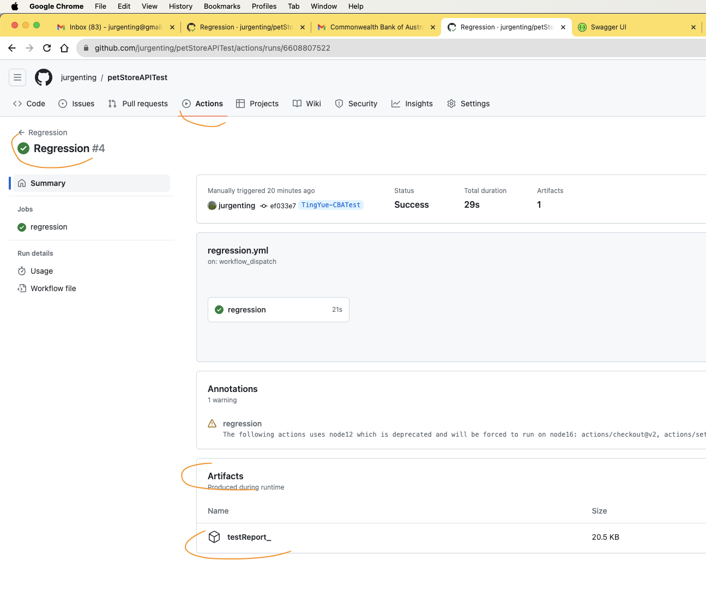
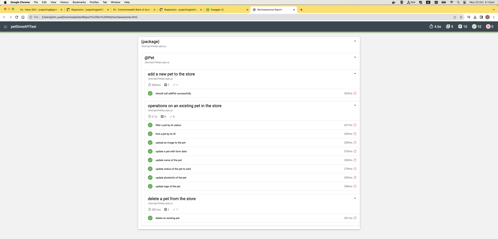

<div align="center">

## Pet Store Automation tests

_Automated tests for [Pet Store](https://github.com/jurgenting/petStoreAPITest)_

[](https://github.com/jurgenting/petStoreAPITest/actions/workflows/regression.yml)


</div>

# swagger_petstore

Automation framework for petStore.

## Installation

### Install Node

Version > 14

### Install dependencies

```shell
npm install
```

## Run Pet test in Github workflow (Recommended)

Go to Github actions tab, choose 'regression' workflow, click 'Run workflow' button.


## Run Pet test in your local

```shell
npm test -- --spec ./test/api/PetApi.spec.js
```

## Test report

### Find test report in Github artifact. Or in your local code repo's 'mochaawesome-report' folder if you ran you test locally.


### Example test report


## api_key

In case api key updated, update it in '.env' file in root dir of this code base.


